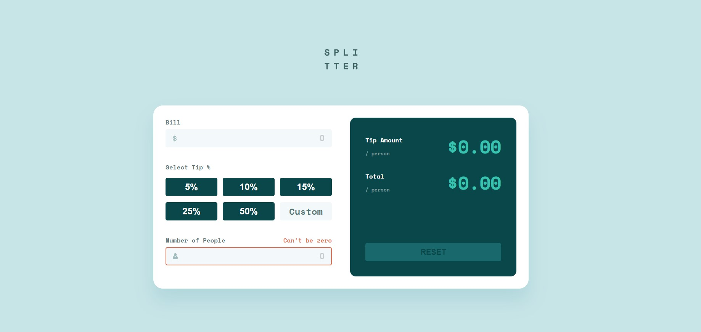

# Frontend Mentor - Tip Calculator app

This is a solution to the [Tip calculator app challenge on Frontend Mentor](https://www.frontendmentor.io/challenges/tip-calculator-app-ugJNGbJUX). Frontend Mentor challenges help you improve your coding skills by building realistic projects.

## Table of contents

- [Frontend Mentor - Tip Calculator app](#frontend-mentor---tip-calculator-app)
  - [Table of contents](#table-of-contents)
  - [Overview](#overview)
    - [The challenge](#the-challenge)
    - [Screenshot](#screenshot)
    - [Links](#links)
  - [My process](#my-process)
    - [Built with](#built-with)
  - [Author](#author)

## Overview

### The challenge

Users should be able to:

- View the optimal layout for the app depending on their device's screen size
- See hover states for all interactive elements on the page
- Calculate the correct tip and total cost of the bill per person
- Implement unit tests for all components
- Implement asseccibility for all tags
- Implement SEO for project

### Screenshot

### Links

- Solution URL: [solution URL](https://github.com/SecretariatV/FM-TIP-Calculator)
- Live Site URL: [live site URL](https://secretariatv.github.io/FM-TIP-Calculator)

## My process

### Built with

- [React](https://reactjs.org/) - JS library
- [Next.js](https://nextjs.org/) - React framework
- [Styled Components](https://styled-components.com/) - For styles
- [SCSS]
- [Vitest]
- [Jest]

## Author

- Website - [Oliver Boucher](https://ovb-portfolio.vercel.app/)
- Frontend Mentor - [@SecretariatV](https://www.frontendmentor.io/profile/SecretariatV)
- Twitter - [@ovb_coder](https://www.twitter.com/ovb_coder)